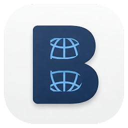

<!-- Logo (pokud je k dispozici) -->

  

# 🚀 **Brow** – Modern macOS Browser _(Electron Nightly)_

  
  
  

> 🌐 **Language:** This README is available in **English**.  
> Switch language: [🇬🇧 English](#english)

---

## ✨ Quick Overview

|                        |                       |
| ---------------------- | --------------------- |
| 🗂️ Multi-Tab           | 🍏 macOS Native       |
| 🏠 Custom Homepage     | 🌙 Dark Mode          |
| 💾 Session Restore     | 🛠️ DevTools           |
| 📚 Bookmarks & History | ⚡ Fast & Lightweight |

---

## 🇬🇧 English

**Brow** is a modern, lightweight web browser built on the latest Electron Nightly for macOS. It delivers a native-like experience, fast startup, and a clean, minimal interface.

Brow is designed for users who value simplicity, speed, and a distraction-free browsing environment. Unlike mainstream browsers, Brow focuses on providing only the essential features, ensuring that your content always takes center stage. Its architecture leverages the cutting-edge Chromium engine via Electron Nightly, guaranteeing compatibility with the latest web standards and technologies.

Brow is ideal for developers, power users, and anyone seeking a customizable, privacy-respecting browser that feels at home on macOS. The app is engineered for extensibility, allowing future enhancements such as plugin support, advanced privacy controls, and deep system integration. All user data is stored locally, giving you full control over your browsing history, bookmarks, and settings.

Whether you need a fast secondary browser for development, a minimal workspace for focused research, or a customizable platform for building your own browser features, Brow is the perfect starting point.

---

## ✨ **Key Features**

- **🗂️ Multi-Tab Browsing:** Effortlessly open, close, and manage multiple tabs with smooth tab switching and drag-and-drop support.
- **🏠 Customizable Homepage:** Set and persist your preferred homepage, loaded on startup and for new tabs.
- **💾 Session Restore:** Automatically saves and restores your last opened tabs after restart—never lose your browsing session.
- **🧭 Modern Titlebar & Navigation:** Custom titlebar with back, forward, reload, home, and bookmark controls. Responsive layout adapts to window size.
- **🌙 Dark Mode Support:** Seamlessly switch between light and dark themes for comfortable browsing at any time.
- **🛠️ Integrated DevTools:** Instantly access Chromium DevTools for debugging and development.
- **📚 History & Bookmarks:** Built-in buttons for browsing history and managing bookmarks _(UI-ready, extendable)_.
- **⚡ Performance:** Utilizes Electron Nightly for the latest performance improvements and web standards.
- **🍏 macOS Native Feel:** Optimized exclusively for macOS, including native window controls and smooth system integration.

---

## 🧑‍💻 **User Experience**

- **Minimal UI:** Focused on content, with a distraction-free interface and intuitive controls.
- **Responsive Design:** Adapts to different window sizes, including a compact mode with a hamburger menu for smaller screens.
- **Quick Search:** Instantly search or enter URLs directly from the tab bar.
- **Persistent Settings:** All user preferences and session data are stored securely in the app's data folder.

---

## 🛠️ **Technology**

- **Electron Nightly:** Always up-to-date with the latest Chromium and Node.js features.
- **Custom State Management:** Fast, file-based storage for user data and settings.
- **Web Standards:** Full support for modern HTML5, CSS3, and JavaScript.

---

## 🚦 **Philosophy & Extensibility**

Brow is built with a "less is more" philosophy, stripping away unnecessary clutter and focusing on what matters most: your browsing experience. The codebase is modular and well-documented, making it easy for developers to contribute, fork, or extend the browser for their own needs.

**Planned features include:**

- Plugin and extension support
- Advanced privacy and security controls
- Enhanced bookmark and history management
- Deeper macOS integration (e.g., Touch Bar, Handoff, native notifications)

---

> **Brow** is ideal for users and developers who want a fast, simple, and modern browser experience tailored for macOS, with the flexibility of Electron for future customization and extension.
